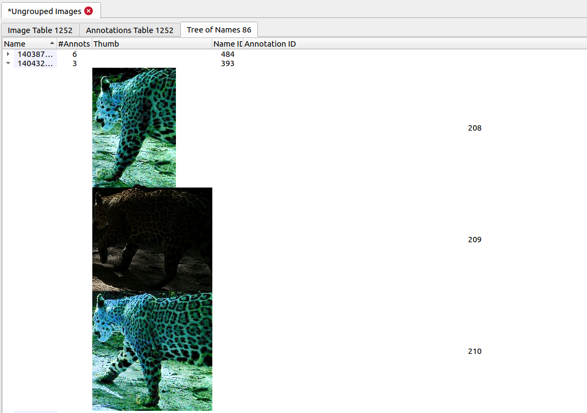
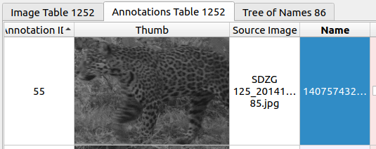

# uniqorn
Machine learning tools for individual identification using SIFT features

## Using uniqorn
1. Install [IBEIS](https://github.com/Erotemic/ibeis). uniqorn depends on IBEIS to extract SIFT features and computed annotation matches.
2. Create a new database
3. Import images from the directory that contains two subdirectories 
	- uniqorn assumes that the input files will consist of: 
		- A directory with two sub directories named "Left" and "Right", which contains photos of corresponding viewpoint. 
		- A CSV containing the name of the files ("File Name"), the unix time of the picture ("Time"), the location of the picture ("GPS"), and the viewpoint of the picture ('Viewpoint"). 
			- The location does not have to be the coordinates. They could be just the station name/camera name. 
			- Viewpoint are either 1 (right) or 5 (left).  
			- If some of the images already has a name (for example with prior human review), then these names can be marked in an optional name column ("Name"), and the workflow will use this name for all images it determined to be of the same individual. 
3. If the photos are already cropped, then select all the photos and use  `Add annotation from entire image", otherwise crop the images to obtain annotations one by one. 
4. Set the annotation species for all annotations.
5. To use the one vs one sum to compute matches, call
```
python vsone_workflow.py [database_name] [photo_dir] [stations_dir] [images_summary_dir] [csv_destination_dir] [symlink_dir]
```
`databse_name`: name of the IBEIS database to work on, e.g. "MyNewIBEISDatabase"
`photo_dir`: The directory of the images to be queried on
`input_csv`: The CSV containing the information of the images 
`csv_destination_dir`: uniqorn will generate a new CSV containing the metadata of the images. Specify the directory of that CSV here. 
`symlink_dir`: where the symbolic links for manual review of photos will be stored

Example call:
```
python -i vsone_workflow.py "MyDatabase" "/home/yuerou/selected_photos/" "/home/yuerou/info.csv" "/home/yuerou/generated_info.csv" "/home/yuerou/symlinkdir/"
```
6. Inside IBEIS, The results will be reflected in the `Name` column. The Tree of Names will also reflect the clustering. 
7. In the csv generated by the workflow (the csv specified by `csv_destination_dir`, not the `input_csv`), the result of clustering will also be reflected under the "Predicted Name" column. In addition to the predicted names column, it will contain all columns of `input_csv` and a "Symlink Location" columns where it stores the symbolic links for the images.
 
## Manual Review
Sometimes when images are blurry, the workflow cannot identify the same individual from different images. Usually the workflow will have more false negatives (the same individual were put into different groups) than false positive (different individuals were put into the same group). Therefore manual review is necessary. 
The manual review can be done inside IBEIS by looking at the Tree of Names.

If the reviewer believe that any annotation should have a different name, they can modify it in Annotations Table

After modifying the name, run `python -i export_from_ibeis [database_name] [csv_dir]` to export the modified infornmation. The csv directory will be the same directory as the one generated by the workflow. 


## How it works
Uniqorn will first group images based on their GPS coordinates and time. If the time difference between two images are smaller than 120 second and they have the same GPS coordinates, then the two images will be considered from the same occurrence. Next uniqorn will try to group the occurrences of the same individual together. Each images will be queried against images of other occurrences using the One Vs One algorithm from IBEIS. If the algorithm considers two images a match, then the two occurrences the images are from will be grouped together. 
